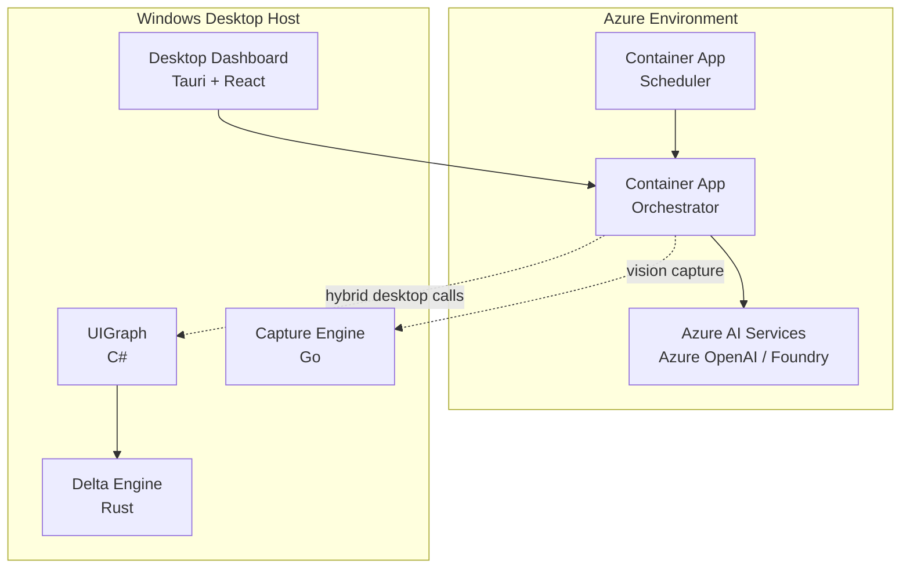

# TELOS — Your Machine's Purpose, Automated

> A Windows-first desktop operations platform that reads running applications through Windows UI Automation as structured state, coordinates specialized agents to execute cross-application tasks, verifies outcomes, and exposes the workflow through a mission-control dashboard.


---

## TL;DR

TELOS is a privacy-first desktop AI operations system for Windows. Instead of relying only on screenshots or browser automation, it uses structured Windows UI Automation to understand running applications, plan multi-step work, execute actions across apps, verify results, and show the full control loop in a live operator dashboard.

For the Microsoft hackathon submission, this repository is positioned as:

- a Windows-first multi-agent desktop operations platform
- with Azure OpenAI, Semantic Kernel, and Azure AI Foundry-ready provider paths
- with GitHub Copilot + VS Code workflow evidence committed in the repository
- with Azure deployment artifacts for the cloud-hosted parts of the system

## Quick Navigation

- [Problem TELOS Solves](#problem-telos-solves)
- [What We Built](#what-we-built)
- [Submission Alignment](#submission-alignment)
- [Target Category Mapping](#target-category-mapping)
- [Architecture Overview](#architecture-overview)
- [Feature Checklist](#feature-checklist)
- [Local Run](#local-run)
- [Demo Readiness](#demo-readiness)
- [Final Submission Package Checklist](#final-submission-package-checklist)
- [Suggested Category Selection Text](#suggested-category-selection-text)

## Problem TELOS Solves

Many real enterprise workflows still happen in Windows desktop applications, not only in browsers. Existing AI assistants often depend on screenshots, OCR, or browser-only automation, which makes desktop work brittle, hard to verify, and risky for privacy-sensitive data.

TELOS addresses this by combining:

- structured Windows UI Automation for desktop perception
- specialized agents for planning, reading, writing, verification, and vision
- privacy filtering and egress logging before outbound LLM calls
- a mission-control dashboard that shows execution state, privacy metrics, and system health live

This makes TELOS suitable for operator workflows where reliability, observability, and privacy matter more than chat alone.

## Why This Matters

TELOS is built for a category of work that many AI demos skip:

- desktop applications still dominate many operational workflows
- privacy-sensitive data should not leave the machine by default
- cross-application execution needs verification, not blind action
- judges and reviewers need a system that is easy to understand from architecture, demo, and repo evidence

## What We Built

From direct repository evidence, TELOS currently includes:

- a FastAPI orchestrator for task intake, routing, privacy enforcement, SSE events, and provider calls
- a specialist-agent pipeline: Planner, Reader, Writer, Verifier, Vision
- a Go scheduler with persistent jobs, manual triggers, and execution history
- a C# Windows UI Automation service for structured desktop state and action execution
- a Rust delta engine for visual diff analysis
- a Go screenshot engine for multimodal capture
- a Tauri + React desktop dashboard
- SQLite-backed local memory by default, with optional Firestore backend
- privacy filtering, password masking, and egress logging
- Azure OpenAI, Semantic Kernel, and Azure AI Foundry-ready provider paths
- a local MCP-style stdio server for task-history style tooling

## Hackathon Positioning

### Best Current Fit

TELOS is best positioned as:

- an AI agent application using Microsoft technologies
- a multi-agent desktop operations platform with Azure integration
- a secure, privacy-aware enterprise desktop automation system

### Honest Claim Discipline

This README is intentionally evidence-based.

TELOS is **not** currently claiming:

- full Azure MCP integration
- WebMCP support
- Azure SRE Agent integration
- fully proven live Azure deployment from this repository alone
- a separately proven Microsoft Agent Framework implementation beyond the Semantic Kernel-backed Microsoft path

## Submission Alignment

This repository is written against the official Microsoft AI Dev Days Global Hackathon materials:

- https://github.com/Azure/AI-Dev-Days-Hackathon/blob/main/README.md
- https://github.com/Azure/AI-Dev-Days-Hackathon/blob/main/OFFICIAL_RULES.md

From those official materials, the key submission requirements for this hackathon are:

- use one or more hero technologies: Microsoft Foundry, Microsoft Agent Framework, Azure MCP, or GitHub Copilot Agent Mode
- deploy to Azure and leverage Azure services
- host the project in a public GitHub repository
- develop with VS Code or Visual Studio and enhance with GitHub Copilot
- provide a public demo video that is less than 2 minutes long
- provide a project description explaining what was built, what problem it solves, and which Microsoft/Azure technologies were used
- provide an architecture diagram
- provide team information, including Microsoft Learn usernames for participants
- ensure the project functions as depicted in the video and description

TELOS aligns with that official submission model as follows:

| Requirement Area | Current Repo Status | Notes |
|---|---|---|
| GitHub Copilot + VS Code usage | Implemented and documented | See `.github/copilot-instructions.md` and `.github/prompts/` |
| Azure-backed provider path | Implemented | Azure OpenAI, Semantic Kernel, and Foundry-ready paths are present |
| Public repo evidence | Ready | Docs, setup, architecture, and hackathon mapping are committed |
| Demo-friendly workflow | Ready | See `docs/demo/HERO_DEMO.md` |
| Installation/testing clarity | Ready | See `docs/SETUP.md` |
| Architecture diagram | Ready | See `ARCHITECTURE.md`; add a visual diagram to submission materials if possible |
| Team information / Microsoft Learn usernames | Pending submission metadata | Must be filled on the submission form |
| Azure deployment proof | Partial | Azure deployment template exists; live Azure proof should be captured separately |

## Target Category Mapping

Based on the official hackathon categories, TELOS currently fits best as:

- **Best Multi-Agent System**
  - strongest current fit because the repository clearly implements a specialist multi-agent pipeline, internal A2A-style event bus, and a local MCP-style server
- **Best Enterprise Solution**
  - strong secondary fit because TELOS has privacy filtering, egress logging, auth controls, deployment artifacts, and a clear enterprise operations story
- **Best Azure Integration**
  - partial fit because Azure provider paths and Azure deployment artifacts exist, but live deployment proof should be captured for a stronger claim
- **Best Use of Microsoft Foundry**
  - partial fit because the Foundry-ready provider path exists, but live Foundry proof should be captured for a stronger claim

TELOS is less suited to the Agentic DevOps grand-prize track because the repository is centered on desktop operations automation rather than CI/CD, SRE, and reliability engineering workflows.

## Microsoft Technology Verification

This section is intentionally precise.

### Verified

- **Azure OpenAI provider path**
  - Implemented in `services/orchestrator/providers/azure_provider.py`
  - Uses Azure endpoint + API key + deployment name from environment variables

- **Semantic Kernel usage**
  - `semantic-kernel` dependency is present in `services/orchestrator/requirements.txt`
  - Implemented in `services/orchestrator/providers/semantic_kernel_provider.py`

- **Azure deployment template**
  - Present in `deploy/azure-deploy.yaml`
  - Includes Container Apps structure, probes, secrets model, and env placeholders

- **GitHub Copilot workflow artifacts**
  - Project-specific instructions in `.github/copilot-instructions.md`
  - Reusable prompts in `.github/prompts/`

### Partially Verified

- **Semantic Kernel-backed Microsoft agent path**
  - Strongly evidenced via provider implementation
  - The repo proves Semantic Kernel more clearly than a separate Microsoft Agent Framework layer

- **Azure AI Foundry**
  - `services/orchestrator/providers/foundry_provider.py` exists and is wired into provider selection
  - The implementation is HTTP-based against a Foundry-compatible endpoint rather than the newer `azure-ai-projects` project-endpoint flow

- **MCP**
  - A local MCP-style stdio server is implemented in `services/orchestrator/mcp_server.py`
  - This is not the same as proving Azure Foundry Agent Service MCP integration

### Not Currently Claimed

- WebMCP integration
- Azure MCP integration as a proven live capability
- Azure SRE Agent integration

For file-level evidence, see `docs/HACKATHON_TECH_MAP.md`.

## Architecture Overview

TELOS is composed of six core runtime pieces:

1. **Desktop Shell** — Tauri + React operator dashboard
2. **Orchestrator** — Python FastAPI control plane and multi-agent execution engine
3. **UIGraph Service** — C# Windows UI Automation service
4. **Screenshot Engine** — Go screenshot service for multimodal inputs
5. **Delta Engine** — Rust visual diff engine
6. **Scheduler** — Go scheduler with persistent jobs and history

High-level architecture:

```text
Desktop Dashboard (Tauri + React)
        |
        v
  Orchestrator (FastAPI)
   |      |       |
   |      |       +--> Provider layer (Azure OpenAI / SK / Foundry-ready)
   |      +----------> Scheduler (Go)
   +-----------------> UIGraph (C#) -> Delta Engine (Rust)
                    
Additional capture path:
Screenshot Engine (Go) -> VisionAgent -> Provider layer
```

Detailed architecture is in `ARCHITECTURE.md`.

### Visual Architecture Diagram

```mermaid
flowchart LR
  UI[Mission Control Dashboard\nTauri + React] --> ORCH[Orchestrator\nFastAPI]
  UI --> SSE[SSE Event Stream]
  SSE --> UI

  ORCH --> PLAN[Planner Agent]
  ORCH --> READ[Reader Agent]
  ORCH --> WRITE[Writer Agent]
  ORCH --> VERIFY[Verifier Agent]
  ORCH --> VISION[Vision Agent]

  ORCH --> PROVIDERS[Provider Layer\nAzure OpenAI | Semantic Kernel | Foundry-ready]
  ORCH --> UIGRAPH[UIGraph Service\nC# UI Automation]
  ORCH --> SCHED[Scheduler\nGo]
  ORCH --> MEMORY[Memory\nSQLite | Firestore]

  UIGRAPH --> DELTA[Delta Engine\nRust]
  VISION --> CAPTURE[Screenshot Engine\nGo]
  CAPTURE --> PROVIDERS
```

### Hybrid Azure Deployment Diagram



## Core System Capabilities

### Agents

TELOS contains a real specialist-agent pipeline:

- **Planner**: decomposes a task into ordered steps
- **Reader**: reads source application state from UIGraph
- **Writer**: performs write actions into target applications
- **Verifier**: confirms expected results
- **Vision**: supports image/screenshot analysis when privacy settings allow

Primary files:

- `services/orchestrator/router.py`
- `services/orchestrator/agents/`

### UIGraph

The C# UIGraph service is a core differentiator of the project.

It provides:

- visible window discovery
- structured UI tree extraction
- password masking
- window focus control
- UI action execution through UIAutomation and fallback SendKeys

Primary files:

- `uigraph/windows/Program.cs`
- `uigraph/windows/Services/UIAutomationService.cs`

### Scheduler

The scheduler is implemented as a real Go service, not a placeholder.

It provides:

- persistent scheduled jobs
- manual trigger endpoint
- cron validation
- run history storage
- orchestrator forwarding

Primary file:

- `services/scheduler/main.go`

### Privacy and Security

TELOS includes real privacy controls:

- password masking for UIA-extracted password-like fields
- PII filtering before LLM egress
- egress logging with destination and byte counts
- API token support
- rate limiting and CORS hardening

Primary files:

- `services/orchestrator/privacy/filter.py`
- `services/orchestrator/privacy/egress.py`
- `services/orchestrator/middleware/auth.py`
- `services/orchestrator/middleware/rate_limit.py`

### Memory

TELOS implements real persistence:

- default memory backend: SQLite
- optional backend: Firestore

Primary files:

- `services/orchestrator/memory/store.py`
- `services/orchestrator/memory/firestore_store.py`

## Feature Checklist

### Implemented

- [x] FastAPI orchestrator
- [x] Planner / Reader / Writer / Verifier / Vision agents
- [x] Internal A2A-style async event bus
- [x] SSE event stream to frontend
- [x] C# Windows UI Automation service
- [x] Go screenshot engine
- [x] Rust delta engine
- [x] Go scheduler with jobs, trigger, and history
- [x] Tauri + React dashboard
- [x] Privacy filtering and egress logging
- [x] Azure OpenAI provider path
- [x] Semantic Kernel provider path
- [x] Azure AI Foundry-ready provider path
- [x] Local MCP-style stdio server
- [x] Local SQLite-backed persistence
- [x] 146 Python tests passing in the verified hardening pass

### Partially Implemented or Partially Proven

- [~] Azure Container Apps deployment: template-ready, live deployment proof separate
- [~] Azure AI Foundry: wired and documented, but live Foundry proof should be captured separately
- [~] MCP interoperability: local server exists, live external MCP client proof is separate
- [~] Firestore backend: implemented, but requires external cloud configuration
- [~] Multimodal Azure AI story: implemented in code path, depends on privacy settings and live provider setup for demo

### Not Implemented or Not Claimed

- [ ] WebMCP transport
- [ ] Azure SRE Agent integration
- [ ] Fully cloud-only replacement for the Windows desktop automation stack

## GitHub Copilot + VS Code Usage

For the Microsoft submission, Copilot usage is a real part of the repo evidence, not just a claim.

Committed evidence includes:

- `.github/copilot-instructions.md`
  - project-specific Copilot guidance for privacy, Windows-first development, and polyglot consistency
- `.github/prompts/hackathon-review.prompt.md`
  - review-oriented prompt asset for hackathon readiness
- `.github/prompts/local-run-hardening.prompt.md`
  - local-run validation prompt asset
- `.github/prompts/readme-judge-ready.prompt.md`
  - judge-facing documentation refinement prompt asset

Copilot-assisted work reflected in the repo includes:

- security/privacy hardening
- cross-service env-var and port consistency cleanup
- test repair and regression verification
- hackathon-tech mapping and README truth-tightening

## Documentation Map

Use these files depending on what you need:

| Document | Purpose |
|---|---|
| `docs/SETUP.md` | canonical setup and troubleshooting guide |
| `ARCHITECTURE.md` | detailed subsystem architecture |
| `docs/HACKATHON_TECH_MAP.md` | file-level technology and category mapping |
| `docs/demo/HERO_DEMO.md` | demo walkthrough and talking points |
| `walkthrough.md` | concise submission-oriented architecture narrative |
| `docs/PENDING.md` | honest list of remaining gaps and post-submission work |

## Local Run

### Platform Assumptions

Full TELOS desktop functionality currently requires:

- Windows 10/11
- Node.js 18+
- Python 3.11+
- Go 1.22+
- .NET 8 SDK
- Rust with Windows MSVC target
- Visual Studio Build Tools / MSVC

### Required Environment Setup

1. Copy `.env.example` to `.env`
2. Choose one Microsoft provider path
3. Fill in the required credentials
4. For screenshot / vision demos, set:
   - `TELOS_PRIVACY_MODE=balanced`
   - `TELOS_ALLOW_IMAGE_EGRESS=true`

### Recommended Microsoft Demo Providers

For the fastest Microsoft-path local run:

- `TELOS_PROVIDER=azure`
  or
- `TELOS_PROVIDER=azure_sk`

### Startup Order

1. UIGraph
2. Delta Engine
3. Screenshot Engine
4. Scheduler
5. Orchestrator
6. Desktop app

You can also use:

```powershell
.\scripts\start-all.ps1
```

### Health Checks

- Orchestrator: `GET /health`
- Orchestrator readiness: `GET /ready`
- System snapshot for dashboard: `GET /system/state`
- Scheduler: `GET /health`
- UIGraph: `GET /health`
- Delta Engine: `GET /health`
- Screenshot Engine: `GET /health`

The combined dashboard status endpoint is:

```text
/system/state
```

See `docs/SETUP.md` for full commands.

## Demo Readiness

The current strongest demo story is:

- show the dashboard and system health
- show UIGraph reading a real desktop app via structured UI Automation
- submit a natural-language task
- show Planner -> Reader -> Writer -> Verifier progression
- show privacy and egress metrics live
- optionally show Scheduler creating and triggering repeatable jobs

Demo guide:

- `docs/demo/HERO_DEMO.md`

## Final Submission Package Checklist

The official Azure AI Dev Days materials require a submission package that is coherent, public, and runnable as described. For TELOS, the final package should include:

- [x] Updated README with problem statement, implementation evidence, and run guidance
- [x] Architecture explanation in the repository
- [x] Visual architecture diagram in the README
- [x] Public GitHub repository
- [ ] Public demo video under 2 minutes
- [ ] Submission-form project pitch describing problem, solution, and Microsoft technologies used
- [ ] Microsoft Learn username(s) for all participant(s)
- [ ] Azure deployment explanation, even if the runtime is hybrid
- [ ] Category selection text aligned to the official categories
- [ ] Confirmation that the project functions exactly as shown in the video

### Submission Safety Checks

- Do not include copyrighted music in the demo video.
- Avoid unnecessary third-party trademarks unless they are essential to the demo.
- Keep the recorded workflow consistent with the documented setup and actual runtime behavior.
- If using third-party applications in the demo, ensure you are authorized to show them and that the workflow is stable on your machine.

## Suggested Category Selection Text

### Primary Category

**Best Multi-Agent System**

Suggested justification:

> TELOS is a Windows-first multi-agent desktop operations platform that coordinates specialized Planner, Reader, Writer, Verifier, and Vision agents over a shared orchestration layer, internal A2A-style event bus, and local MCP-style task tooling. Its core innovation is combining structured Windows UI Automation with agent planning, action execution, verification, and operator-visible observability.

### Secondary Category

**Best Enterprise Solution**

Suggested justification:

> TELOS is designed for privacy-sensitive enterprise workflows where desktop applications still dominate real operational work. The system includes PII filtering, password masking, egress logging, API auth controls, hybrid Azure deployment artifacts, and a mission-control dashboard that makes execution and privacy state visible to operators.

### Conditional Category

**Best Azure Integration**

Use this only if you can show live Azure-backed execution and explain the hybrid deployment clearly.

Suggested justification:

> TELOS integrates Azure-backed model provider paths through Azure OpenAI and Semantic Kernel, and includes Azure Container Apps deployment artifacts for the cloud-hosted orchestration layer. The desktop automation stack remains Windows-hosted, making the overall architecture a practical hybrid Azure deployment model.

### Conditional Category

**Best Use of Microsoft Foundry**

Use this only if you can run and record the Foundry path live.

Suggested justification:

> TELOS includes an Azure AI Foundry-ready provider path that routes desktop-operation tasks through a Foundry-compatible endpoint while preserving the same multi-agent orchestration and privacy-aware control flow used by the rest of the platform.

## Azure Deployment Model

TELOS currently includes an Azure Container Apps deployment template in `deploy/azure-deploy.yaml`.

### What Is Implemented

- container app structure for orchestrator and scheduler
- secret placeholders
- environment variable wiring
- liveness and readiness probes

### Important Deployment Note

TELOS is currently a **hybrid Azure architecture**:

- cloud components: orchestrator, scheduler
- Windows-host components: UIGraph, screenshot engine, delta engine

This means the Azure deployment template should be understood as:

- Azure-ready for cloud services
- hybrid for full desktop automation
- not yet proven as a full cloud-only desktop replacement

## Evidence Matrix

| Claim | Status | Evidence |
|---|---|---|
| Real specialist-agent pipeline | VERIFIED | `services/orchestrator/router.py`, `services/orchestrator/agents/` |
| Azure OpenAI provider path | VERIFIED | `services/orchestrator/providers/azure_provider.py` |
| Semantic Kernel usage | VERIFIED | `services/orchestrator/providers/semantic_kernel_provider.py`, `services/orchestrator/requirements.txt` |
| Semantic Kernel-backed Microsoft path | VERIFIED | provider exists and is wired into runtime selection |
| Azure AI Foundry-ready path | PARTIALLY VERIFIED | `services/orchestrator/providers/foundry_provider.py` |
| Local MCP-style server | VERIFIED | `services/orchestrator/mcp_server.py` |
| Azure MCP integration | NOT CLAIMED AS VERIFIED | not proven as a live Azure-linked MCP flow |
| WebMCP | NOT VERIFIED | no implementation evidence in repo |
| SQLite local memory | VERIFIED | `services/orchestrator/memory/store.py` |
| Firestore memory backend | PARTIALLY VERIFIED | implemented, external cloud setup required |
| Azure Container Apps template | VERIFIED | `deploy/azure-deploy.yaml` |
| Live Azure deployment proof | NOT VERIFIED | separate artifact needed |
| Copilot + VS Code workflow evidence | VERIFIED | `.github/copilot-instructions.md`, `.github/prompts/` |

## Limitations

- UIGraph integration requires target applications to expose usable UIA surfaces
- some Electron or highly custom-rendered applications can be less reliable for write operations than standard Windows controls
- the Vision path is gated by privacy settings and provider configuration
- the Azure deployment story is hybrid rather than fully cloud-native for the Windows automation stack
- Semantic Kernel usage metrics are limited by SDK response surfaces compared with raw HTTP provider responses

## Repository Status

Recent hardening work verified:

- SSE PII leakage fixed
- CORS tightened
- token handling improved in the desktop app
- screenshot and delta engine port conflicts resolved
- writer retry backoff corrected
- egress logging added to reader/writer flows
- setup and hackathon docs corrected to match live code
- targeted verification and full-suite evidence recorded during the remediation pass

## License and IP Hygiene

- License: MIT (`LICENSE`)
- Third-party notice: `NOTICE.md`

For submission safety:

- keep demo video free of unlicensed music
- avoid unnecessary third-party trademarks in the video unless needed for the demo
- ensure any assets used in screenshots or recordings are authorized for use

## Where To Go Next

- To run the project: `docs/SETUP.md`
- To understand the architecture: `ARCHITECTURE.md`
- To map claims to files: `docs/HACKATHON_TECH_MAP.md`
- To prepare the demo: `docs/demo/HERO_DEMO.md`
- To review remaining gaps: `docs/PENDING.md`

## License

MIT — see `LICENSE`
