# TELOS Architecture Diagram

## System Architecture (Mermaid)

```mermaid
flowchart TB
    subgraph USER["👤 User Layer"]
        CMD["Command Bar<br/>(Natural Language Input)"]
        DASH["Mission Control Dashboard<br/>(Tauri 2 + React + Zustand)"]
    end

    subgraph GCP["☁️ Google Cloud Platform"]
        subgraph CLOUDRUN["Cloud Run"]
            ORCH["🧠 Orchestrator<br/>(FastAPI, port 8080)"]
            SCHED["⏰ Scheduler<br/>(Go, port 8081)"]
        end
        FS["🗄️ Firestore<br/>(Task Memory)"]
        SM["🔐 Secret Manager<br/>(API Keys)"]
        CB["🏗️ Cloud Build<br/>(CI/CD)"]
        CR["📦 Container Registry<br/>(Docker Images)"]
    end

    subgraph GEMINI["🤖 Google Gemini API"]
        GEM["Gemini 2.0 Flash<br/>(google-genai SDK)"]
        ADK["Google ADK<br/>(Agent Dev Kit)"]
    end

    subgraph AGENTS["🕹️ Multi-Agent Pipeline"]
        PLAN["📋 Planner Agent<br/>(Task Decomposition)"]
        READ["📖 Reader Agent<br/>(UI Data Extraction)"]
        WRITE["✍️ Writer Agent<br/>(UI Action Execution)"]
        VERIFY["✅ Verifier Agent<br/>(Action Confirmation)"]
        VISION["👁️ Vision Agent<br/>(Screenshot + Multimodal LLM)"]
        ADKNAV["🧭 ADK Navigator<br/>(Live WebSocket Agent)"]
    end

    subgraph PRIVACY["🛡️ Privacy Pipeline"]
        PII["PII Masker<br/>(SSN, Email, Phone, CC)"]
        EGRESS["Egress Logger<br/>(JSONL Audit Trail)"]
        PWMASK["Password Filter<br/>(Auto-Redaction)"]
    end

    subgraph WINDOWS["🖥️ Windows Desktop Companion"]
        UIA["Windows MCP / UIGraph<br/>(C#, UI Automation, port 8083)"]
        CAP["📸 Capture Engine<br/>(Go, Screenshots, port 8085)"]
        DELTA["🔄 Delta Engine<br/>(Rust/Axum, Visual Diff, port 8084)"]
    end

    subgraph APPS["🖥️ Target Desktop Applications"]
        APP1["Notepad / Word"]
        APP2["Calculator"]
        APP3["Browser / Any Windows App"]
    end

    %% User -> System
    CMD --> ORCH
    DASH <-->|SSE Events + IPC| ORCH

    %% Orchestrator internals
    ORCH --> PLAN
    PLAN -->|Decomposed Steps| READ
    PLAN -->|Decomposed Steps| WRITE
    PLAN -->|Decomposed Steps| VERIFY
    PLAN -->|Decomposed Steps| VISION
    ORCH --> ADKNAV

    %% Agent -> LLM
    PLAN -->|Privacy Filtered| GEM
    VISION -->|Screenshot + Prompt| GEM
    ADKNAV --> ADK
    ADK --> GEM

    %% Privacy
    PLAN --> PII
    VISION --> EGRESS
    READ --> PWMASK

    %% Agent -> Windows
    READ -->|HTTP| UIA
    WRITE -->|HTTP| UIA
    VERIFY -->|via Reader| UIA
    VISION -->|HTTP| CAP

    %% Windows -> Apps
    UIA -->|UI Automation API| APP1
    UIA -->|UI Automation API| APP2
    UIA -->|UI Automation API| APP3
    CAP -->|Screen Capture| APP1
    CAP -->|Screen Capture| APP2

    %% Delta Engine
    DELTA -.->|UI Snapshot Diff| UIA

    %% Cloud services
    ORCH <-->|Task Persistence| FS
    ORCH -->|Read Secrets| SM
    CB -->|Build & Push| CR
    CR -->|Deploy Image| CLOUDRUN
    SCHED -->|POST /task| ORCH

    %% Styling
    classDef gcp fill:#4285F4,stroke:#1a73e8,color:#fff
    classDef gemini fill:#8E24AA,stroke:#6A1B9A,color:#fff
    classDef agent fill:#FB8C00,stroke:#E65100,color:#fff
    classDef privacy fill:#43A047,stroke:#2E7D32,color:#fff
    classDef windows fill:#0078D4,stroke:#005A9E,color:#fff
    classDef user fill:#546E7A,stroke:#37474F,color:#fff

    class ORCH,SCHED,FS,SM,CB,CR gcp
    class GEM,ADK gemini
    class PLAN,READ,WRITE,VERIFY,VISION,ADKNAV agent
    class PII,EGRESS,PWMASK privacy
    class UIA,CAP,DELTA windows
    class CMD,DASH user
```



## Data Flow Summary

```
User Input (natural language)
    │
    ▼
┌─────────────────────────────────────────────┐
│  ORCHESTRATOR (Cloud Run)                   │
│  ┌─────────┐    ┌──────────────────────┐   │
│  │ Auth +   │───>│ Planner Agent        │   │
│  │ Rate     │    │ (LLM decomposes task │   │
│  │ Limiter  │    │  into ordered steps) │   │
│  └─────────┘    └──────────┬───────────┘   │
│                            │                │
│              ┌─────────────┼────────────┐   │
│              ▼             ▼            ▼   │
│         ┌────────┐   ┌────────┐  ┌───────┐ │
│         │ Reader │   │ Writer │  │Vision │ │
│         │ Agent  │   │ Agent  │  │Agent  │ │
│         └───┬────┘   └───┬────┘  └──┬────┘ │
│             │            │          │       │
│    ┌────────┘            │          │       │
│    ▼                     ▼          ▼       │
│  ┌──────────┐     ┌──────────┐  ┌────────┐ │
│  │ Verifier │     │ Privacy  │  │ Egress │ │
│  │ Agent    │     │ Filter   │  │ Logger │ │
│  └──────────┘     └──────────┘  └────────┘ │
│                                             │
│  ┌──────────────┐    ┌───────────────────┐  │
│  │ A2A Event Bus│───>│ SSE /events stream│  │
│  └──────────────┘    └───────────────────┘  │
└─────────────────────────────────────────────┘
         │              │              │
         ▼              ▼              ▼
    ┌─────────┐   ┌──────────┐   ┌─────────┐
    │ Windows │   │ Capture  │   │ Gemini  │
    │ UIGraph │   │ Engine   │   │ 2.0     │
    │ (C#)    │   │ (Go)     │   │ Flash   │
    └────┬────┘   └────┬─────┘   └─────────┘
         │              │
         ▼              ▼
    ┌──────────────────────┐
    │  Windows Desktop     │
    │  (Target Apps)       │
    └──────────────────────┘
```

## Google Cloud Services Map

| Service | Purpose | Evidence |
|---------|---------|----------|
| **Cloud Run** | Hosts orchestrator + scheduler containers | `deploy/Dockerfile.cloudrun`, `deploy/deploy-gcloud.sh` |
| **Cloud Build** | Automated Docker image builds | `cloudbuild.yaml` |
| **Secret Manager** | Stores GEMINI_API_KEY and TELOS_API_TOKEN | `--set-secrets` in deploy script |
| **Firestore** | Cloud-backed task memory and history | `services/orchestrator/memory/firestore_store.py` |
| **Container Registry** | Docker image storage | `gcr.io/telos-agent/telos-orchestrator` |
| **Gemini API** | LLM inference (text + multimodal vision) | `services/orchestrator/providers/gemini_provider.py` |

## Port Map

| Port | Service | Language | Location |
|------|---------|----------|----------|
| 8080 | Orchestrator (FastAPI) | Python | Cloud Run |
| 8081 | Scheduler | Go | Cloud Run |
| 8083 | Windows MCP / UIGraph | C# | Windows Host |
| 8084 | Delta Engine | Rust (Axum) | Windows Host |
| 8085 | Capture Engine | Go | Windows Host |
| 1420 | Tauri Dashboard | React/Vite | Windows Host |
