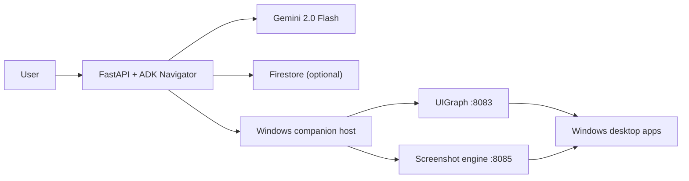

# TELOS architecture diagram

## Reading the diagram

- The FastAPI service is the Gemini orchestration layer.
- Gemini reasons over screenshot input and chooses tools.
- The Windows companion executes the UI actions and produces screenshots.
- Firestore is optional for cloud-backed memory when deployed on Google Cloud.
